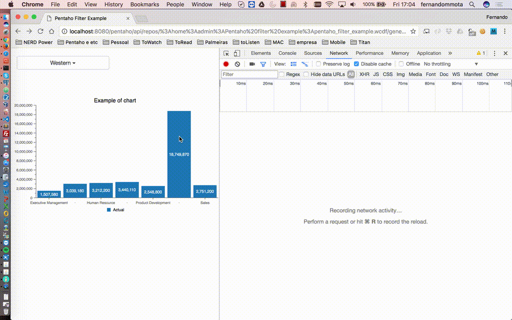
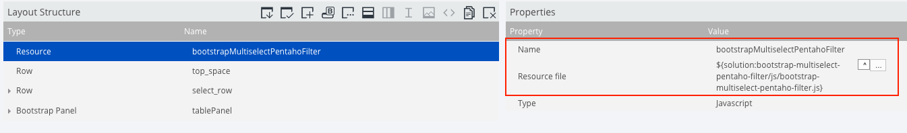
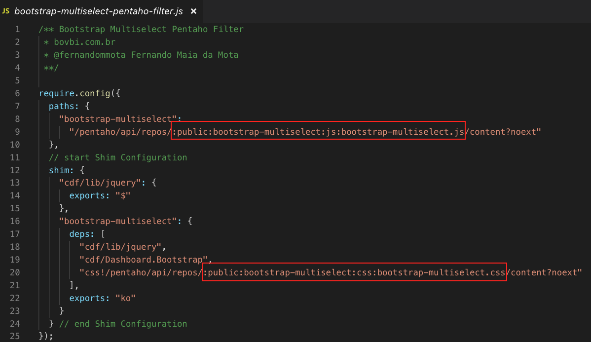

# Bootstrap Multiselect Pentaho Filter

### Overview

This plugin apply the [All Member propertie of Mondrian Schema](http://mondrian.pentaho.com/documentation/schema.php#The_all_member) with [Bootstrap Multiselect plugin](http://davidstutz.github.io/bootstrap-multiselect/) creating a better user experience.



If the user select the all options available, the request value parameter will be send with the All Member propertie configured in setup script.

### Setup

Ps. For dashboards without RequireJS support enable should be usage the previous version ([0.3](https://github.com/fernandommota/bootstrap-multiselect-pentaho-filter/tree/0.3)).

#### Inside repository (jackrabbit persistence)

- Download the repository as a zip file and import to your instance, the following example is consider the path _public/bootstrap-multiselect-pentaho-filter_.
- Inside your CDE dashboard insert the file _js/bootstrap-multiselect-pentaho-filter.js_ path as a "Javascript External File" resource:

```JavaScript
${solution:bootstrap-multiselect/js/bootstrap-multiselect-pentaho-filter.js}
```

- It's necessary maintain the property name as _bootstrapMultiselectPentahoFilter_, this will be load as a variable with the functions of plugin:
  

- In case the path of files be different of default example, update the shim configuration at _bootstrap-multiselect-pentaho-filter.js_ to new path:
  

### Usage

- Add the follow function in preExecution propertie of multiselect component in a Pentaho CDF/CDA/CDE dashboard:

Ps. The variable _bootstrapMultiselectPentahoFilter_ now is used to call the internal functions of plugin.

```JavaScript
function preExecution(){
    var obj = this;

    obj.postExecution = function f(){
        bootstrapMultiselectPentahoFilter.postExecutionSelect.call(
            this
            // Change to all member propertie of dimension
            , '[Dimension Name].[All Member Name]'
            // Change the labels about dimension
            , 'Find dimension'
            , 'Select a member'
            , 'All members'
            , ' - members selected'
            // end labels about dimension
	    )
    }

    obj.preChange = function (newChoice){
        // Change to all member propertie of dimension
        return bootstrapMultiselectPentahoFilter.preChangeSelect.call(this,  '[Dimension Name].[All Member Name]', newChoice);
    };

    obj.postFetch = function postFetch(result){
    	// configure the option for set the default value of parameter
        bootstrapMultiselectPentahoFilter.postFetchSelect.call(this, result, 'all');
    };
}
```

### Options

If the parameter of filter is empty is possible in preChange function to configure who options by default will be selected, the options are:

- "all" - All options of multiselect will be selected.
- "first" - The first option of multiselect will be selected.
- "first-n" - The first n options of multiselect will be selected.
- "last" - The last option of multiselect will be selected.
- "last-n" - The last n options of multiselect will be selected.

```JavaScript
    //example for default select the last 4 options in multiselect element.
    obj.postFetch = function postFetch(result){
        postFetchSelect.call(this, result, 'last-4');
    };
```
